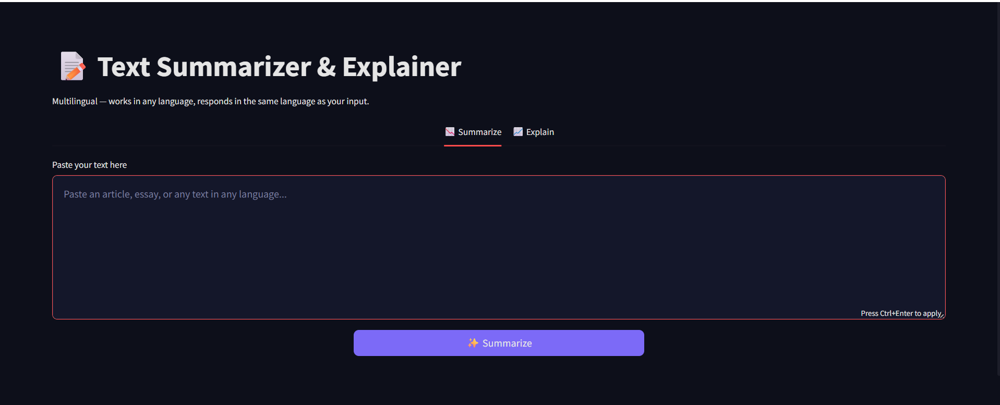

# 📝 Text Summarizer & Explainer

A fast, multilingual text summarization and explanation tool powered by Groq's Llama 3.1 — paste any text in any language, and get either a concise summary that preserves the central theme, or an expanded explanation strictly grounded in the source content.



## Features

- **Summarize tab** — compresses text while identifying and preserving its true central theme (not just a shortened list of sentences)
- **Explain tab** — expands and clarifies text, strictly grounded in what's actually stated in the source (no invented facts or outside knowledge added)
- **Fully multilingual** — automatically detects the input language and responds in the same language, whether that's English, Hindi, or anything else
- **Fast** — powered by Groq's LPU inference, results typically return in 1-3 seconds
- **Clean, dark UI** — built with Streamlit, no clutter, no unnecessary configuration

## Tech Stack

- **Python 3**
- **Streamlit** — UI framework
- **Groq API** (`llama-3.1-8b-instant`) — instruction-tuned LLM for summarization and explanation
- **python-dotenv** — environment variable management

## Why Groq?

Unlike extractive models (e.g. BART), Llama 3.1 is instruction-tuned — it can genuinely follow prompts like "preserve the central theme" or "only elaborate on what's stated, never add outside facts." Combined with Groq's inference speed, this makes the tool both fast and reliably on-topic, rather than trading one for the other.

## Setup

1. Clone the repository:
   ```bash
   git clone <your-repo-url>
   cd TextSummarizer
   ```

2. Install dependencies:
   ```bash
   pip install -r requirements.txt
   ```

3. Get a free API key from [console.groq.com](https://console.groq.com)

4. Create a `.env` file in the project root:
   ```
   GROQ_API_KEY=your-key-here
   ```

5. Run the app:
   ```bash
   streamlit run app.py
   ```

## How It Works

1. Paste text into either the **Summarize** or **Explain** tab
2. The app sends the text to Groq along with a task-specific system prompt
3. For summarization, the model identifies the central theme first, then produces a summary that preserves it — avoiding the common failure mode of a summary that captures surface details but loses the actual point
4. For explanation, the model is explicitly constrained to only elaborate on content already present in the source — reducing the risk of hallucinated facts
5. Length is judged automatically by the model based on the content, rather than requiring the user to configure targets

## Project Structure

```
TextSummarizer/
├── app.py              # Main Streamlit app
├── requirements.txt    # Python dependencies
├── .env                # API key (not committed)
└── .gitignore
```

## Notes

- The app requires an active internet connection and a valid Groq API key
- Groq's free tier has rate limits (requests/tokens per minute); the app surfaces a clear message if a limit is hit rather than failing silently

## Author

**Akash Kumar** — [GitHub](https://github.com/imakash45)